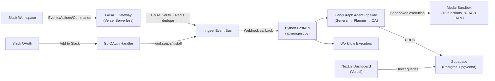
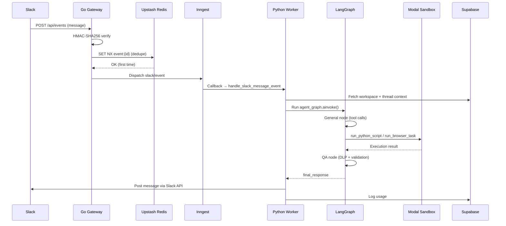

# KlawHub v2 — Complete Codebase Analysis

> Full read of every source file across Go API, Python backend, Modal sandbox, and Next.js dashboard.

---

## High-Level Architecture

## Technology Stack

| Layer | Technology | Files |
|-------|-----------|-------|
| **API Gateway** | Go 1.22 serverless (Vercel) | `api/events/events.go`, `api/actions/actions.go`, `api/commands/commands.go`, `api/oauth/oauth.go`, `api/health/health.go` |
| **Event Bus** | Inngest Cloud (durable queues) | `src/core/inngest_client.py` |
| **Cognitive Worker** | Python 3.12 + LangGraph + FastAPI | `api/inngest.py`, `src/` (44 files) |
| **LLM** | Nemotron (OpenAI-compatible API) | `src/core/llm/client.py` |
| **Sandbox** | Modal (isolated containers) | `modal_app.py` (18 functions) |
| **Database** | Supabase (Postgres + pgvector + RLS) | `src/db/operations.py`, `src/db/client.py` |
| **Cache** | Upstash Redis (REST API) | Go handlers only |
| **Browser** | Lightpanda CDP + Playwright fallback | `modal_app.py` |
| **Search** | Tavily API | `src/core/tools/web_search.py` |
| **Dashboard** | Next.js 14 + Tailwind + Framer Motion | `app/` (14 files) |

---

## Complete File Map

### Go API Gateway (`api/`)

| File | Lines | Purpose |
|------|-------|---------|
| [events.go](file:///c:/Users/HP/klaw/klawhub/api/events/events.go) | 198 | Slack Events API → HMAC verify → Redis dedupe → Inngest `slack/event` |
| [actions.go](file:///c:/Users/HP/klaw/klawhub/api/actions/actions.go) | 135 | Slack Interactive Actions → HMAC verify → Inngest `slack/action` |
| [commands.go](file:///c:/Users/HP/klaw/klawhub/api/commands/commands.go) | 150 | Slack Slash Commands → HMAC verify → Inngest `slack/command` |
| [oauth.go](file:///c:/Users/HP/klaw/klawhub/api/oauth/oauth.go) | 151 | Slack OAuth callback → token exchange → Inngest `workspace/install` |
| [health.go](file:///c:/Users/HP/klaw/klawhub/api/health/health.go) | 36 | Health check endpoint (GET, returns JSON status) |
| [inngest.py](file:///c:/Users/HP/klaw/klawhub/api/inngest.py) | 50 | FastAPI app registering 6 Inngest workflow functions |

**Key patterns**: Each Go file is compiled independently by `@vercel/go` — helper functions (`mathAbs`, `dispatchToInngest`) are duplicated intentionally. 5-minute replay protection. Redis deduplication uses `SET NX EX 3600`.

---

### Python Cognitive Worker (`src/`)

#### Configuration

| File | Lines | Purpose |
|------|-------|---------|
| [config.py](file:///c:/Users/HP/klaw/klawhub/src/config.py) | 71 | Pydantic Settings — all env vars (LLM, Supabase, Slack, Inngest, Modal, Tavily, Google, GitHub, security) |
| [inngest_client.py](file:///c:/Users/HP/klaw/klawhub/src/core/inngest_client.py) | 16 | Singleton Inngest client shared across all workflows |

#### LangGraph Agent Pipeline

| File | Lines | Purpose |
|------|-------|---------|
| [graph.py](file:///c:/Users/HP/klaw/klawhub/src/core/agents/graph.py) | 63 | StateGraph with 3 nodes: General → Planner → QA. Conditional routing via `next_node` state field |
| [graph_state.py](file:///c:/Users/HP/klaw/klawhub/src/core/agents/graph_state.py) | 28 | TypedDict: workspace_id, channel_id, thread_ts, messages, next_node, planner_depth, output, final_response |
| [general.py](file:///c:/Users/HP/klaw/klawhub/src/core/agents/nodes/general.py) | 248 | **Primary agent node** — 24-tool registry, up to 8 tool-call iterations, planner delegation with depth guard, workspace_id auto-injection |
| [planner.py](file:///c:/Users/HP/klaw/klawhub/src/core/agents/nodes/planner.py) | 165 | Multi-step milestone planner — decomposes into 3-5 milestones, Slack progress cards, sequential execution |
| [qa.py](file:///c:/Users/HP/klaw/klawhub/src/core/agents/nodes/qa.py) | 65 | DLP redaction + LLM factual validation. Max 2 correction loops before force-bypass |

#### LLM Client

| File | Lines | Purpose |
|------|-------|---------|
| [client.py](file:///c:/Users/HP/klaw/klawhub/src/core/llm/client.py) | 111 | Async Nemotron client — non-streaming with tenacity retry (3 attempts, 2-30s backoff), streaming with SSE parsing, 300s timeout |

#### Security

| File | Lines | Purpose |
|------|-------|---------|
| [ast_scanner.py](file:///c:/Users/HP/klaw/klawhub/src/core/security/ast_scanner.py) | 103 | AST-based code scanner — blocks dangerous imports (os, subprocess, sys), names (eval, exec), attributes (__globals__), calls |
| [dlp_auditor.py](file:///c:/Users/HP/klaw/klawhub/src/core/security/dlp_auditor.py) | 41 | Regex-based DLP — redacts Slack tokens, DB URIs, private keys, AWS keys, etc. |
| [encryptor.py](file:///c:/Users/HP/klaw/klawhub/src/core/security/encryptor.py) | 71 | AES-256-GCM encryption for credential storage in Supabase |

#### Agent Tools (24 tools)

| File | Lines | Tools | Purpose |
|------|-------|-------|---------|
| [web_search.py](file:///c:/Users/HP/klaw/klawhub/src/core/tools/web_search.py) | 44 | search_web | Tavily search (basic/advanced depth) |
| [memory_tools.py](file:///c:/Users/HP/klaw/klawhub/src/core/tools/memory_tools.py) | 77 | add_memory, search_memory, add_knowledge, search_knowledge | pgvector similarity search + Modal embeddings |
| [schedule_tools.py](file:///c:/Users/HP/klaw/klawhub/src/core/tools/schedule_tools.py) | 68 | create_schedule, list_schedules, delete_schedule | Cron schedule CRUD with croniter validation |
| [task_tools.py](file:///c:/Users/HP/klaw/klawhub/src/core/tools/task_tools.py) | 55 | create_task, list_tasks, update_task | Task CRUD with status/priority filtering |
| [workflow_tools.py](file:///c:/Users/HP/klaw/klawhub/src/core/tools/workflow_tools.py) | 76 | create_workflow, list_workflows, update_workflow, trigger_workflow | Workflow CRUD + Inngest trigger |
| [skill_creator.py](file:///c:/Users/HP/klaw/klawhub/src/core/tools/skill_creator.py) | 103 | create_skill | LLM generates Python → AST scan → Modal test → DB insert (pending_approval) |
| [skill_runner.py](file:///c:/Users/HP/klaw/klawhub/src/core/tools/skill_runner.py) | 33 | run_skill | Execute skill in Modal sandbox |
| [slack_tools.py](file:///c:/Users/HP/klaw/klawhub/src/core/tools/slack_tools.py) | 63 | get_slack_client, post_message, update_message, add_reaction, fetch_thread_history | Slack Web API with encrypted bot tokens |
| [google_tools.py](file:///c:/Users/HP/klaw/klawhub/src/core/tools/google_tools.py) | 115 | list_calendar_events, create_calendar_event, list_drive_files | Google Workspace via encrypted OAuth tokens |
| [github_tools.py](file:///c:/Users/HP/klaw/klawhub/src/core/tools/github_tools.py) | 131 | list_repos, create_issue, list_issues, create_pull_request | GitHub REST API v3 |

#### Database

| File | Lines | Purpose |
|------|-------|---------|
| [client.py](file:///c:/Users/HP/klaw/klawhub/src/db/client.py) | 68 | asyncpg connection pool (min=2, max=10) with lazy init |
| [operations.py](file:///c:/Users/HP/klaw/klawhub/src/db/operations.py) | 645 | **Largest file** — ALL CRUD operations for 12 tables + SQL injection protection via column allowlisting |

#### Integrations

| File | Lines | Purpose |
|------|-------|---------|
| [slack/client.py](file:///c:/Users/HP/klaw/klawhub/src/integrations/slack/client.py) | 11 | Thin wrapper — global `slack_client` singleton |
| [slack/context_loader.py](file:///c:/Users/HP/klaw/klawhub/src/integrations/slack/context_loader.py) | 49 | Thread → conversation format, sliding-window token trimming (120K) |
| [slack/formatter.py](file:///c:/Users/HP/klaw/klawhub/src/integrations/slack/formatter.py) | 84 | Slack Block Kit builder — progress cards, approval cards, status cards |
| [tavily/client.py](file:///c:/Users/HP/klaw/klawhub/src/integrations/tavily/client.py) | 11 | Thin wrapper — global `tavily_client` singleton |

#### Inngest Workflows

| File | Lines | Trigger | Purpose |
|------|-------|---------|---------|
| [message_handler.py](file:///c:/Users/HP/klaw/klawhub/src/workflows/message_handler.py) | 189 | `slack/event`, `slack/command` | Main handler — loads context → runs LangGraph → posts Slack response → logs usage |
| [proactive_loop.py](file:///c:/Users/HP/klaw/klawhub/src/workflows/proactive_loop.py) | 115 | Cron (15 min) | Checks due schedules: standup, reminder, silence_detector |
| [skill_installer.py](file:///c:/Users/HP/klaw/klawhub/src/workflows/skill_installer.py) | 141 | `skill/install` | GitHub repo → zipball → extract → AST scan → DB insert (pending_approval) |
| [workflow_executor.py](file:///c:/Users/HP/klaw/klawhub/src/workflows/workflow_executor.py) | 117 | `workflow/trigger` | Sequential step execution: message / skill / tool |
| [workspace_installer.py](file:///c:/Users/HP/klaw/klawhub/src/workflows/workspace_installer.py) | 54 | `workspace/install` | Encrypt bot token → upsert workspace → seed 6 built-in skills → register admin |

---

### Modal Sandbox (`modal_app.py`)

| File | Lines | Purpose |
|------|-------|---------|
| [modal_app.py](file:///c:/Users/HP/klaw/klawhub/modal_app.py) | 601 | **18 sandbox functions** in isolated containers (8-16GB RAM) |

**Functions**: run_python_script, run_browser_task, render_pdf, render_pdf_from_template, convert_document, batch_convert, ocr_image, ocr_pdf_pages, ocr_screenshot, resize_image, annotate_image, compare_images, render_email, compress_files, extract_archive, run_shell_command, embed_texts, test_skill

**Container image**: 40+ Python packages (WeasyPrint, Pandoc, pdfplumber, pandas, scikit-learn, plotly, yfinance, PaddleOCR, Playwright, Lightpanda, FastEmbed, etc.)

---

### Next.js Dashboard (`app/`)

| File | Lines | Purpose |
|------|-------|---------|
| [layout.tsx](file:///c:/Users/HP/klaw/klawhub/app/layout.tsx) | 34 | Root layout — Outfit + Plus Jakarta Sans fonts, ambient glow backgrounds |
| [page.tsx](file:///c:/Users/HP/klaw/klawhub/app/page.tsx) | 97 | Landing page — hero, CTA ("Add to Slack" + "Enter Dashboard"), feature grid |
| [globals.css](file:///c:/Users/HP/klaw/klawhub/app/globals.css) | 54 | Tailwind + glassmorphism + ambient glows + custom scrollbars |
| [middleware.ts](file:///c:/Users/HP/klaw/klawhub/app/middleware.ts) | 53 | Supabase auth guard for `/dashboard/*` routes |
| [auth/callback/route.ts](file:///c:/Users/HP/klaw/klawhub/app/auth/callback/route.ts) | 23 | OAuth callback — exchange code for Supabase session |
| [dashboard/layout.tsx](file:///c:/Users/HP/klaw/klawhub/app/dashboard/layout.tsx) | 108 | Dashboard shell — sidebar (8 nav items) + header bar |
| [dashboard/page.tsx](file:///c:/Users/HP/klaw/klawhub/app/dashboard/page.tsx) | 203 | Overview — 4 stat cards + live execution stream table |
| [dashboard/skills/page.tsx](file:///c:/Users/HP/klaw/klawhub/app/dashboard/skills/page.tsx) | 210 | Skills catalog — 6 built-in skills + custom skill installer |
| [dashboard/schedules/page.tsx](file:///c:/Users/HP/klaw/klawhub/app/dashboard/schedules/page.tsx) | 279 | Schedule CRUD — cron/standup/reminder/silence_detector |
| [dashboard/tasks/page.tsx](file:///c:/Users/HP/klaw/klawhub/app/dashboard/tasks/page.tsx) | 329 | Kanban task board — Pending/Running/Completed columns |
| [dashboard/workflows/page.tsx](file:///c:/Users/HP/klaw/klawhub/app/dashboard/workflows/page.tsx) | 265 | Workflow designer — create/trigger/delete multi-step workflows |
| [dashboard/knowledge/page.tsx](file:///c:/Users/HP/klaw/klawhub/app/dashboard/knowledge/page.tsx) | 235 | Knowledge base — search/create/delete with pgvector |
| [dashboard/usage/page.tsx](file:///c:/Users/HP/klaw/klawhub/app/dashboard/usage/page.tsx) | 106 | Usage telemetry — token consumption + latency stats |
| [dashboard/settings/page.tsx](file:///c:/Users/HP/klaw/klawhub/app/dashboard/settings/page.tsx) | 286 | AI persona config + integrations OAuth management |

---

### Verification Script

| File | Lines | Purpose |
|------|-------|---------|
| [verify_all_27.py](file:///c:/Users/HP/klaw/klawhub/verify_all_27.py) | 357 | Audit verification — checks 27 findings across all files (bugs, gaps, weaknesses, recommendations) |

---

## Supabase Tables

| Table | Used By | Columns (inferred) |
|-------|---------|-------------------|
| `workspaces` | workspace_installer, settings page, message_handler | id, slack_team_id, slack_team_name, bot_token (encrypted), persona_name, persona_prompt, whitelisted_channels |
| `workspace_members` | workspace_installer | workspace_id, slack_user_id, role |
| `skills` | skill_creator, skill_runner, skill_installer, workspace_installer, skills page | id, slug, name, description, code, activation_status, skill_type, workspace_id |
| `schedules` | schedule_tools, proactive_loop, schedules page | id, name, schedule_type, cron_expr, channel_id, is_active, next_run_at, workspace_id |
| `tasks` | task_tools, tasks page | id, title, description, status, priority, due_at, completed_at, assigned_agent, workspace_id |
| `workflows` | workflow_tools, workflow_executor, workflows page | id, name, description, trigger_type, trigger_config, steps (JSON), is_active, workspace_id |
| `knowledge` | memory_tools, knowledge page | id, title, content, source_type, embedding (vector 384), workspace_id |
| `memory` | memory_tools | id, content, embedding (vector 384), workspace_id |
| `usage_logs` | message_handler, dashboard page, usage page | id, workspace_id, agent_name, action, skill_used, prompt_tokens, completion_tokens, latency_ms, status |
| `agent_states` | message_handler | id, workspace_id, thread_ts, state (JSON) |
| `processed_events` | message_handler | event_id, processed_at |
| `integrations` | google_tools, github_tools, settings page | id, workspace_id, provider, access_token (encrypted), email |
| `pending_actions` | (approval workflows) | id, workspace_id, action_type, payload |

---

## Event Flow

---

## Known Issues & TODOs

### 🔴 Critical / Bugs

| # | Issue | Location | Details |
|---|-------|----------|---------|
| 1 | **Middleware location wrong** | [middleware.ts](file:///c:/Users/HP/klaw/klawhub/app/middleware.ts) | Inside `app/` — Next.js requires it at project root. Auth guard is NOT running. |
| 2 | **Modal secrets not injected** | [modal_app.py](file:///c:/Users/HP/klaw/klawhub/modal_app.py) | `klawhub_secret` defined but never applied to `@app.function` decorators |
| 3 | **Token tracking not implemented** | [message_handler.py](file:///c:/Users/HP/klaw/klawhub/src/workflows/message_handler.py) | `prompt_tokens=0, completion_tokens=0` — always logs zero |
| 4 | **HMAC verification empty** | [message_handler.py](file:///c:/Users/HP/klaw/klawhub/src/workflows/message_handler.py) | `hmac_sig` always stored as `""` — agent state integrity not enforced |

### 🟡 Significant Gaps

| # | Issue | Location | Details |
|---|-------|----------|---------|
| 5 | **Hardcoded workspace_id** | All dashboard pages | Uses mock UUID `"b3196921-28c3-4cc9-964f-fa775f5b3e6b"` instead of auth session |
| 6 | **Hardcoded Supabase URL/key** | [dashboard/page.tsx](file:///c:/Users/HP/klaw/klawhub/app/dashboard/page.tsx) | Fallback to hardcoded URL + mock anon key — leaks project ref |
| 7 | **No auth context/provider** | Dashboard pages | Each page creates its own Supabase client at module level |
| 8 | **Mock embeddings** | [knowledge/page.tsx](file:///c:/Users/HP/klaw/klawhub/app/dashboard/knowledge/page.tsx) | Random 384-dim vectors on create — pollutes vector search |
| 9 | **Slack OAuth link incomplete** | [page.tsx](file:///c:/Users/HP/klaw/klawhub/app/page.tsx) | Missing `client_id` and `scope` URL params |
| 10 | **No Google OAuth refresh** | [google_tools.py](file:///c:/Users/HP/klaw/klawhub/src/core/tools/google_tools.py) | Tokens used without refresh logic — will expire |
| 11 | **`window.prompt()` for OAuth** | [settings/page.tsx](file:///c:/Users/HP/klaw/klawhub/app/dashboard/settings/page.tsx) | Placeholder — not real OAuth flow |
| 12 | **Upstash Redis unused in Python** | `src/config.py` | Redis env vars configured but never used in the Python codebase |
| 13 | **`run_skill` function missing** | [modal_app.py](file:///c:/Users/HP/klaw/klawhub/modal_app.py) | Referenced in docs but only `test_skill` exists |
| 14 | **Hardcoded user info** | [dashboard/layout.tsx](file:///c:/Users/HP/klaw/klawhub/app/dashboard/layout.tsx) | "Timi Dev Workspace / Admin Role / TD" — not from auth |
| 15 | **Dashboard active runs always 0** | [dashboard/page.tsx](file:///c:/Users/HP/klaw/klawhub/app/dashboard/page.tsx) | `activeRuns` never calculated |
| 16 | **Monthly usage counts all-time** | [dashboard/page.tsx](file:///c:/Users/HP/klaw/klawhub/app/dashboard/page.tsx) | `monthlyUsage = allLogs.length` — not filtered by month |
| 17 | **No mobile responsive sidebar** | [dashboard/layout.tsx](file:///c:/Users/HP/klaw/klawhub/app/dashboard/layout.tsx) | No hamburger menu or sidebar collapse |

### 🟢 Minor / Code Quality

| # | Issue | Location | Details |
|---|-------|----------|---------|
| 18 | **`os` import unused** | [config.py](file:///c:/Users/HP/klaw/klawhub/src/config.py) | Import but never used |
| 19 | **`co_varnames` hack** | [general.py](file:///c:/Users/HP/klaw/klawhub/src/core/agents/nodes/general.py) | Fragile workspace_id injection — breaks with functools.partial, classes |
| 20 | **Font loading via `<link>`** | [layout.tsx](file:///c:/Users/HP/klaw/klawhub/app/layout.tsx) | Should use `next/font` for optimization |
| 21 | **Status badges always green** | [dashboard/page.tsx](file:///c:/Users/HP/klaw/klawhub/app/dashboard/page.tsx) | Regardless of actual status |
| 22 | **`.glass-panel-hover` unused** | [globals.css](file:///c:/Users/HP/klaw/klawhub/app/globals.css) | Defined but never applied |
| 23 | **No Firefox scrollbar styling** | [globals.css](file:///c:/Users/HP/klaw/klawhub/app/globals.css) | WebKit-only scrollbar styles |
| 24 | **Older Supabase packages** | [package.json](file:///c:/Users/HP/klaw/klawhub/package.json) | Uses deprecated `@supabase/auth-helpers-nextjs` |
| 25 | **Encryptor crashes at import** | [encryptor.py](file:///c:/Users/HP/klaw/klawhub/src/core/security/encryptor.py) | Invalid `ENCRYPTION_KEY` crashes entire module at import time |
| 26 | **Rec#23 missing from verify script** | [verify_all_27.py](file:///c:/Users/HP/klaw/klawhub/verify_all_27.py) | Jumps from #22 to #24 |
| 27 | **`use client` on landing page** | [page.tsx](file:///c:/Users/HP/klaw/klawhub/app/page.tsx) | No client-side state — could be server component |
| 28 | **Hardcoded usage stats** | [usage/page.tsx](file:///c:/Users/HP/klaw/klawhub/app/dashboard/usage/page.tsx) | Fallback values: 142050 tokens, 820ms latency, $0.00 Modal credits |

---

## Key Design Decisions

1. **3-Layer Security**: AST scanner (pre-execution) → DLP auditor (post-execution) → QA agent (factual validation)
2. **Encrypted Credential Storage**: All tokens encrypted with AES-256-GCM before DB storage
3. **Multi-Tenant**: `workspace_id` permeates all DB queries, tool calls, state management
4. **Event-Driven**: Go gateway → Inngest events → Python workflow handlers (fully async)
5. **Sandboxed Execution**: All user/agent code runs in Modal containers, never in main process
6. **Self-Evolution**: Agent can create new skills via `skill_creator` → AST scan → sandbox test → approval workflow
7. **Global Singletons**: `settings`, `llm_client`, `encryptor`, `dlp_auditor`, `inngest_client` — all module-level

---

## Built-in Skills (Seeded on Workspace Install)

1. **Document Master** — PDF/DOCX/XLSX/CSV/PPTX creation, parsing, editing
2. **Data Science Lab** — EDA, visualization, ML pipeline
3. **Financial Modeler** — DCF, technical analysis, market data
4. **FullStack Engineer** — code gen, lint, test, deploy
5. **Research Synthesizer** — multi-source deep research
6. **Scheduler & Automation Engine** — crons, tasks, workflows
