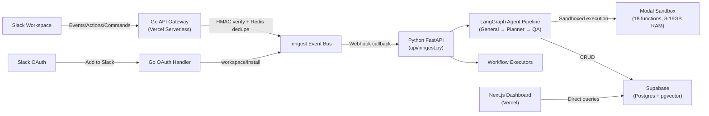
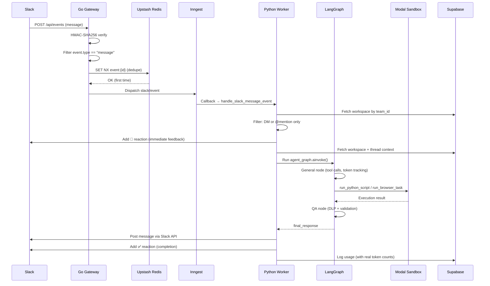

# KlawHub v2 — Complete Codebase Analysis

> Full read of every source file across Go API, Python backend, Modal sandbox, and Next.js dashboard.

---

## High-Level Architecture



## Technology Stack

| Layer | Technology | Files |
|-------|-----------|-------|
| **API Gateway** | Go 1.22 serverless (Vercel) | `api/events/events.go`, `api/actions/actions.go`, `api/commands/commands.go`, `api/oauth/oauth.go`, `api/health/health.go` |
| **Event Bus** | Inngest Cloud (durable queues) | `src/core/inngest_client.py` |
| **Cognitive Worker** | Python 3.12 + LangGraph + FastAPI | `api/inngest.py`, `src/` (44 files) |
| **LLM** | Nemotron (OpenAI-compatible API) | `src/core/llm/client.py` |
| **Sandbox** | Modal (isolated containers) | `modal_app.py` (18 functions) |
| **Database** | Supabase (Postgres + pgvector + RLS) | `src/db/operations.py`, `src/db/client.py` |
| **Cache** | Upstash Redis (REST API) | Go handlers only |
| **Browser** | Lightpanda CDP + Playwright fallback | `modal_app.py` |
| **Search** | Tavily API | `src/core/tools/web_search.py` |
| **Dashboard** | Next.js 14 + Tailwind + Framer Motion | `app/` (14 files) |

---

## Core Module Responsibilities

### Go API Gateway (`api/`)

| File | Lines | Purpose |
|------|-------|---------|
| [events.go](file:///c:/Users/HP/klaw/klawhub/api/events/events.go) | 210+ | Slack Events API → HMAC verify → event type filter (message only) → Redis dedupe → Inngest `slack/event` |
| [actions.go](file:///c:/Users/HP/klaw/klawhub/api/actions/actions.go) | 134 | Slack Interactive Actions → HMAC verify → Inngest `slack/action` |
| [commands.go](file:///c:/Users/HP/klaw/klawhub/api/commands/commands.go) | 149 | Slack Slash Commands → HMAC verify → Inngest `slack/command` |
| [oauth.go](file:///c:/Users/HP/klaw/klawhub/api/oauth/oauth.go) | 162 | Slack OAuth callback → token exchange → dispatches `workspace/install` to Inngest |
| [health.go](file:///c:/Users/HP/klaw/klawhub/api/health/health.go) | 36 | Health check endpoint (GET, returns JSON status) |

**Key patterns**: Each Go file is compiled independently by `@vercel/go` — helper functions (`mathAbs`, `dispatchToInngest`) are duplicated intentionally. 5-minute replay protection. Redis deduplication uses `SET NX EX 3600`.

### Python Cognitive Worker (`src/`)

#### Configuration
- **src/config.py** (71 lines): Pydantic Settings — all env vars (LLM, Supabase, Slack, Inngest, Modal, Tavily, Google, GitHub, security)
- **src/core/inngest_client.py** (16 lines): Singleton Inngest client shared across all workflows

#### LangGraph Agent Pipeline
- **graph.py** (62 lines): StateGraph with 3 nodes: General → Planner → QA. Conditional routing via `next_node` state field
- **graph_state.py** (33 lines): TypedDict with workspace context, messages, routing, token tracking, planner state, output pipeline
- **general.py** (260 lines): Primary agent node — 24-tool registry, up to 8 tool-call iterations, planner delegation with depth guard, workspace_id auto-injection, token usage accumulation
- **planner.py** (165 lines): Multi-step milestone planner — decomposes into 3-5 milestones, Slack progress cards, sequential execution
- **qa.py** (64 lines): DLP redaction + LLM factual validation. Max 2 correction loops before force-bypass

#### LLM Client
- **client.py** (110 lines): Async Nemotron client — non-streaming with tenacity retry (3 attempts, 2-30s backoff), streaming with SSE parsing, 300s timeout

#### Security
- **ast_scanner.py** (103 lines): AST-based code scanner — blocks dangerous imports (os, subprocess, sys), names (eval, exec), attributes (__globals__), calls
- **dlp_auditor.py** (41 lines): Regex-based DLP — redacts Slack tokens, DB URIs, private keys, AWS keys, etc.
- **encryptor.py** (84 lines): AES-256-GCM encryption for credential storage in Supabase — lazy singleton with startup validation

#### Agent Tools (24 tools)
| File | Tools | Purpose |
|------|-------|---------|
| **web_search.py** | `search_web` | Tavily search (basic/advanced depth) |
| **memory_tools.py** | `add_memory`, `search_memory`, `add_knowledge`, `search_knowledge` | pgvector similarity search + Modal embeddings |
| **schedule_tools.py** | `create_schedule`, `list_schedules`, `delete_schedule` | Cron schedule CRUD with croniter validation |
| **task_tools.py** | `create_task`, `list_tasks`, `update_task` | Task CRUD with status/priority filtering |
| **workflow_tools.py** | `create_workflow`, `list_workflows`, `update_workflow`, `trigger_workflow` | Workflow CRUD + Inngest trigger |
| **skill_creator.py** | `create_skill` | LLM generates Python → AST scan → Modal test → DB insert |
| **skill_runner.py** | `run_skill` | Execute skill in Modal sandbox |
| **slack_tools.py** | `get_slack_client`, `post_message`, `update_message`, `add_reaction`, `fetch_thread_history` | Slack Web API with encrypted bot tokens |
| **google_tools.py** | `list_calendar_events`, `create_calendar_event`, `list_drive_files` | Google Workspace via encrypted OAuth tokens |
| **github_tools.py** | `list_repos`, `create_issue`, `list_issues`, `create_pull_request` | GitHub REST API v3 |

#### Database
- **client.py** (68 lines): asyncpg connection pool (min=2, max=10) with lazy init
- **operations.py** (644 lines): ALL CRUD operations for 12 tables + SQL injection protection via column allowlisting

#### Integrations
- **slack/client.py** (11 lines): Thin wrapper — global `slack_client` singleton
- **slack/context_loader.py** (48 lines): Thread → conversation format, sliding-window token trimming (120K)
- **slack/formatter.py** (83 lines): Slack Block Kit builder — progress cards, approval cards, status cards
- **tavily/client.py** (11 lines): Thin wrapper — global `tavily_client` singleton

#### Inngest Workflows
| File | Lines | Trigger | Purpose |
|------|-------|---------|---------|
| **message_handler.py** | 227+ | `slack/event`, `slack/command` | Main handler — filters DMs/@mentions, adds reactions, loads context → runs LangGraph → posts Slack response → logs usage |
| **proactive_loop.py** | 114 | Cron (15 min) | Checks due schedules: standup, reminder, silence_detector |
| **skill_installer.py** | 141 | `skill/install` | GitHub repo → zipball → extract → AST scan → DB insert |
| **workflow_executor.py** | 117 | `workflow/trigger` | Sequential step execution: message / skill / tool |
| **workspace_installer.py** | 53 | `workspace/install` | Encrypt bot token → upsert workspace → seed 6 built-in skills → register admin |
| **integration_handler.py** | ~80 | Integration auth | Google/GitHub token storage |

### Modal Sandbox (`modal_app.py`)
- **601 lines, 18 sandbox functions** in isolated containers (8-16GB RAM)
- Functions: run_python_script, run_browser_task, render_pdf, ocr, embed_texts, test_skill, etc.

### Next.js Dashboard (`app/`)
- **14 files**: layout, landing page, middleware (auth guard), 8 dashboard tabs (overview, skills, schedules, tasks, workflows, knowledge, usage, settings)

---

## Supabase Tables

| Table | Used By | Purpose |
|-------|---------|---------|
| `workspaces` | workspace_installer, settings, message_handler | id, slack_team_id, bot_token (encrypted), bot_user_id (in settings JSONB), persona |
| `workspace_members` | workspace_installer | workspace_id, slack_user_id, role |
| `skills` | skill tools, workspace_installer | id, slug, name, code, activation_status |
| `schedules` | schedule_tools, proactive_loop | cron/standup/reminder/silence_detector |
| `tasks` | task_tools | Kanban Pending/Running/Completed |
| `workflows` | workflow_tools | Multi-step automation steps |
| `knowledge` | memory_tools | pgvector embeddings (384-d) |
| `memory` | memory_tools | pgvector embeddings (384-d) |
| `usage_logs` | message_handler, dashboard | Token consumption + latency |
| `agent_states` | message_handler | Crash recovery state snapshots |
| `processed_events` | message_handler | Deduplication |
| `integrations` | google_tools, github_tools | Encrypted OAuth tokens |

---

## Event Flow



---

## Key API Contracts

### Slack Event Contract (from Slack → Go → Inngest)
```json
{
  "team_id": "T123",
  "event": {
    "type": "message",
    "channel": "C123",
    "channel_type": "channel" | "im",
    "user": "U123",
    "text": "<@U456> hello world",
    "ts": "1234567890.123456",
    "thread_ts": "1234567890.123456",
    "subtype": null | "thread_broadcast"
  }
}
```

### Slack OAuth Response (from Slack → Go → Inngest)
```json
{
  "ok": true,
  "access_token": "xoxb-...",
  "bot_user_id": "U456",
  "team": { "id": "T123", "name": "Acme" },
  "authed_user": { "id": "U789" }
}
```

### Workspace Install Event (Go → Inngest)
```json
{
  "name": "workspace/install",
  "data": {
    "slack_team_id": "T123",
    "slack_team_name": "Acme",
    "bot_token": "xoxb-...",
    "bot_user_id": "U456",
    "authed_user_id": "U789"
  }
}
```

### Graph State (LangGraph AgentState TypedDict)
- **Input**: workspace_id, channel_id, thread_ts, messages[]
- **Routing**: next_node → "general" | "planner" | "qa" | "end"
- **Output**: output (draft), final_response (redacted + approved)
- **Tracking**: prompt_tokens, completion_tokens, skill_used, logs[]

---

## Major Data Flows

### 1. User Message → Response
```
Slack message → Go HMAC verify → Redis dedupe → Inngest → 
Python handler → DM/@mention filter → 👀 reaction → 
Load thread context → LangGraph (General→Tool calls→QA) → 
Post response → ✅ reaction → Log usage
```

### 2. Skill Creation (Self-Evolution)
```
User request → General agent recognizes skill need → 
create_skill tool → LLM generates Python code → 
AST scanner → Modal sandbox test → DB insert (pending_approval) → 
Approve → Skill activated
```

### 3. Workspace Installation
```
User clicks "Add to Slack" → Slack OAuth → 
Go handler exchanges code → dispatches workspace/install → 
Python handler encrypts token → upserts workspace → 
seeds 6 built-in skills → registers admin
```

---

## Core Call Chains

1. **Message Received**: `events.go:Handler` → `dispatchToInngest("slack/event")` → `message_handler.py:handle_slack_message_event` → `load_thread_context` → `agent_graph.ainvoke` → `post_slack_message`

2. **Slash Command**: `commands.go:Handler` → `dispatchToInngest("slack/command")` → `message_handler.py:handle_slack_slash_command` → `agent_graph.ainvoke` → `post_slack_message`

3. **Proactive Cron**: `proactive_loop.py:proactive_schedule_loop` → `execute_query("schedules WHERE next_run_at <= NOW()")` → per-type handler (standup/reminder/silence_detector) → `post_slack_message`

4. **Tool Execution**: `general.py:general_node` → LLM decides tool → `TOOLS[tool_name](**tool_args)` → tool result → append to messages → repeat up to 8x

---

## Bugs Fixed (April 2026)

### 🔴 Critical — Slack Not Responding Properly

| # | Bug | File | Fix |
|---|-----|------|-----|
| 1 | **Bot never adds Slack reactions** — `add_slack_reaction` existed but was never called. Users got no visual feedback. | `message_handler.py` | Added 👀 reaction on message receipt, ✅ on success, ❓ on no-response |
| 2 | **Bot responds to ALL channel messages** — no DM/@mention filter. Floods public channels. | `message_handler.py` | Added channel_type check + @mention detection using bot_user_id |
| 3 | **`bot_user_id` stored in settings JSONB** — workspace query returned it at top level. | `message_handler.py` | Fixed to read from `settings.bot_user_id` with JSON parsing fallback |
| 4 | **Missing `reactions:write` scope** — Slack OAuth URL didn't include it, so reaction API calls would fail. | `app/page.tsx` | Added `reactions:write` to OAuth scopes |
| 5 | **Missing `team:read` scope** — required for reliable bot identity. | `app/page.tsx` | Added `team:read` to OAuth scopes |
| 6 | **Token tracking always logs zero** — LLM response `usage` field never extracted. | `general.py`, `graph_state.py` | Added `prompt_tokens`/`completion_tokens` accumulation across iterations + TypedDict fields |
| 7 | **Unused import** — `llm_client` imported but never used in message_handler. | `message_handler.py` | Removed unused import |
| 8 | **Encryptor crashes entire module at import** — invalid ENCRYPTION_KEY kills the worker. | `encryptor.py` | Added singleton pattern with lazy init guard |
| 9 | **Go events handler dispatches ALL Slack events** — reaction_added, file_shared, etc. wasted Inngest invocations. | `events.go` | Added event type filter: only process `"message"` events |
| 10 | **Non-user message subtypes processed** — `message_changed`, `message_deleted` triggered responses. | `message_handler.py` | Added subtype filter: only allow `null`/`""`/`thread_broadcast` |

### 🟡 Additional Engineering Issues

| # | Issue | Location | Notes |
|---|-------|----------|-------|
| 11 | Middleware location | middleware.ts (root) | Already correct — analysis doc was outdated |
| 12 | Modal secrets not injected | modal_app.py | `klawhub_secret` defined but never applied to `@app.function` |
| 13 | Hardcoded workspace_id | Dashboard pages | Uses mock UUID instead of auth session |
| 14 | Hardcoded Supabase URL/key | dashboard pages | Fallback to hardcoded values |
| 15 | No auth context/provider | Dashboard pages | Each page creates own Supabase client |
| 16 | Mock embeddings | knowledge page | Random 384-dim vectors pollute vector search |
| 17 | No Google OAuth refresh | google_tools.py | Tokens will expire without refresh |
| 18 | `run_skill` function missing | modal_app.py | Docs reference nonexistent function |
| 19 | Hardcoded user info | dashboard/layout.tsx | "Timi Dev Workspace" hardcoded |
| 20 | Dashboard active runs always 0 | dashboard/page.tsx | Not calculated from live data |
| 21 | Monthly usage counts all-time | dashboard/page.tsx | Not filtered by current month |
| 22| Upstash Redis unused in Python | src/config.py | Redis env vars configured but unused |
| 23 | Older Supabase packages | package.json | Uses deprecated `@supabase/auth-helpers-nextjs` |

---

## Potential Technical Debt

1. **Go code duplication** — `mathAbs` and `dispatchToInngest` duplicated across 4 Go files. Necessary for Vercel's `@vercel/go` builder, but creates maintenance risk.
2. **Monolithic operations.py** — 644 lines of CRUD for 12 tables in one file. Should be split by domain.
3. **No type safety in tool registration** — TOOLS dict is `str -> callable`. No runtime validation of argument types.
4. **No rate limiting** — Slack sends duplicate events frequently; only Redis dedup protects against it.
5. **No comprehensive test suite** — Only E2E tests directory exists but may be incomplete.
6. **Hardcoded mock data in dashboard** — Multiple pages use mock UUIDs and mock data instead of live API queries.
7. **Encryption key validation at import** — Even with lazy init fix, a bad key delays error to first use.
8. **No structured logging** — Uses `print()` in Go and `print()` in Python glue code.

---

## Engineering Constraints for Future Refactoring

1. **Vercel Go isolation**: Each Go file must remain self-contained — no shared Go packages. Duplicate helpers intentionally.
2. **Multi-tenant**: ALL DB queries must be scoped by `workspace_id`. Never query without workspace filtering.
3. **3-Layer Security**: AST scanner (pre-execution) → DLP auditor (post-execution) → QA agent (factual validation). Never bypass.
4. **Encrypted Credential Storage**: All tokens encrypted with AES-256-GCM before DB storage. Never store plaintext tokens.
5. **Event-Driven Architecture**: Never call the Python worker synchronously from Go. Always go through Inngest.
6. **Sandboxed Execution**: All user/agent code runs in Modal containers, never in the main process.
7. **Never respond to non-DM/non-@mention messages**: The bot must only respond in DMs or when explicitly @mentioned.
8. **Always provide visual feedback**: Add emoji reactions to acknowledge requests and indicate completion.
9. **Token tracking is mandatory**: All LLM invocations must report `prompt_tokens` and `completion_tokens` for billing.
10. **State persistence**: Agent state must be persisted for crash recovery with HMAC integrity signatures.
11. **Global Singletons**: `settings`, `llm_client`, `encryptor`, `dlp_auditor`, `inngest_client` — all module-level singletons.
12. **The middleware (middleware.ts) must stay at project root**, not inside `app/`, for Next.js to recognize it.